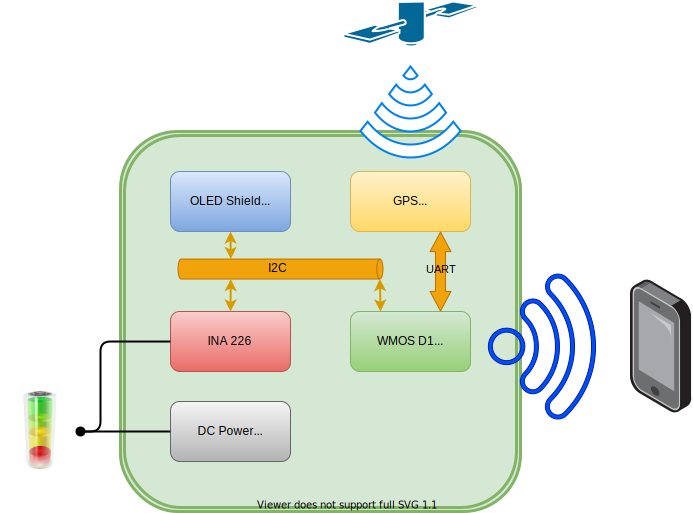
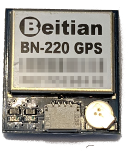
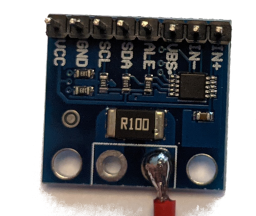
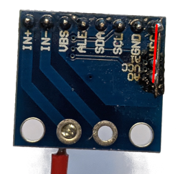
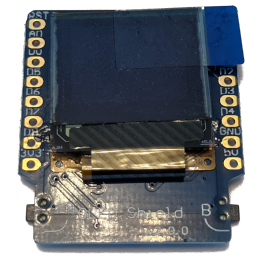
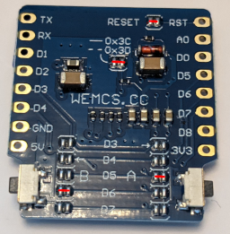
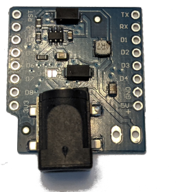
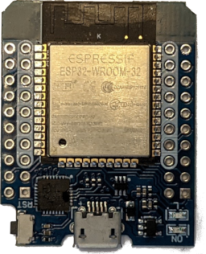
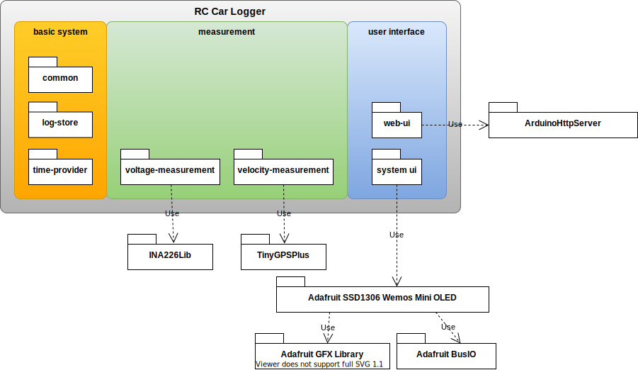

# RC Car Logger system

- [RC Car Logger system](#rc-car-logger-system)
  - [General](#general)
  - [System Overview](#system-overview)
    - [GPS BN 220](#gps-bn-220)
    - [INA 226](#ina-226)
    - [OLED Shield](#oled-shield)
    - [DC Power Schild v1.1.0](#dc-power-schild-v110)
    - [WEMOS D1 Mini](#wemos-d1-mini)
  - [Software](#software)
  - [Pictures of the whole system](#pictures-of-the-whole-system)
  - [Setup the Development System](#setup-the-development-system)
  - [Flashing the firmware.bin](#flashing-the-firmwarebin)

## General
The RC Car Logger should help to measure following informations

* velocity
* battery voltage
* power consumption

This values are measured and recorded. The recorded data can be downloaded from the web ui. The drag indicators `min` and `max` can be read by the system ui and web ui.

## System Overview
The following picture shows the system overview.

All boards and schilds are described on the following chapters.

### GPS BN 220

The GPS receiver is based on the BN220. The RC-Car-Logger uses the UART to read the data provided by the BN220.

| GPS BN220 | WMOS D1 Mini | color of the included cable |
| ---|---|---|
| VCC | VCC | red |
| GND | GND | black |
| Tx | D4 | white |
| Rx | D3 | green |

### INA 226

The INA226 is a TI based board to measure the voltage of the battery and the current consumed by the car. The INA226 is connected by I2C to the WMOS D1 Mini. The I2C address of the board is 0x45, therefore are `A0` and `A1` connected to `VCC`.

| INA 226 | WMOS D1 Mini
| ---|---|
| VCC | VCC |
| GND | GND |
| SCL | D1 |
| SDA | D2 |

The shunt resistor is modified to 0.001 Ohm.

### OLED Shield

The OLED Schild Display V2.0 for Wemos D1 Mini has a size of 0.66" with the resolution 64x48. The display is control over I2C with the address 0x3C. On the board are also two buttons, they are connected as following:

| OLED Schild v2.0| WMOS D1 Mini
| ---|---|
| Button A | D5 |
| Button B | D6 |

### DC Power Schild v1.1.0

The input voltage must be in the range of 7-24V. The schild provide up to 1A on the output.

### WEMOS D1 Mini

## Software
The software is designed to be modular, as far as the effort justifies it. It is possible to adjust the image to match your memory footprint by en- / disable the software components.

You have to adjust in the file [platformio.ini](platformio.ini) the `lib_deps` list. The following overview should make it easier to decide which modules should be used.

The [platformio.ini](platformio.ini) is groped with comments based on the overview. You can remove the rc-car-logger module and the required library (At this point, 2021-07-05 there is a bug in platformio )

## Pictures of the whole system

## Setup the Development System
This Project is based on [platformio.io](https://marketplace.visualstudio.com/items?itemName=platformio.platformio-ide#review-details) for the installation please follow the plug-in installation guide.

## Flashing the firmware.bin
The [espurna](https://github.com/xoseperez/espurna) documentation describes the procedure in detail. Please follow the documentation [espurna/flashing](https://github.com/xoseperez/espurna/wiki/Binaries).
